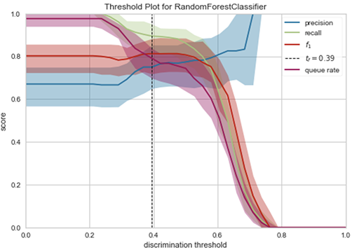

# Loan Approval Model

- **What**: A model to automate loan approval
- **How**: Using feature engineering and a variety of modeling approaches
- **Why**: 

 

## **Process**

This project was broken into 3 main parts:
- EDA
- Data Processing / Feature Engineering
- Modeling

 

## **Data**
This project used data about previous customers who had applied for a loan. With the target variable being "Loan Status" which shows if the loan was approved or not. 

 

## **Model Results**
Using Pycarret for simplicity I was able to test the results of a variety of models. It was found that an LDA model had the highest Accuracy and Recall before tuning. However, a Random Forest Classifier had the highest Precision. So I evaluated both to determine which delivers the most value for the business case at hand. 

Out of all the features, the most important to determining outcome was "credit history."

 

### **LDA Model**
Visulizing the impact of classification threshold I could then experiment with differnt thresholds to tune the results the model produced. 

Shifting from a default of 0.5 to 0.7 the model is more optimized for precission, however at the expence of other metrics such as accuracy and recall

 

### **Random Forest Classifier Model**
For the RFC Model there is a much narrow window for threshold adjustment before serious impact to the models overall performance. 

Thus, the adjustment for this was much more minor from 0.52 -> 0.52. This moved the model towards maximising the desired evaluation metric of precission without causing to many drastic impacts to other performance measures. 

 

## **API & Hosting Model**
Once the modle had been exported I setup an API on an AWS EC2 instance.

A JSON file with details about a loan application could then be pushed to the API. It would return a recomendation if the applicant should be approved or not. 

 

## **Conclusion**
It is amazing what can be done with the right data and some simple experimentation. It would be fascinating to understand what can be done with more data about potential loan applicants. It would also be interesting to know what an industry benchmark is for loan approval models based only on basic input data about applicants. 

Creating a pipeline for data transformations in this project made the iterative process significantly easier and quicker. I look forward in continuing to grow my data engineering skillsets in future projects. As we seem to be reminded again and again, often cleaning/engineering the data is 80% of the world for the modeling. 

As we live in an ever automated world it is amazing what can now be accomplished with such simple and abstracted tools. I have an included an AI art I generated from text as an example to my point.

Look at this beautiful dark future city market!
